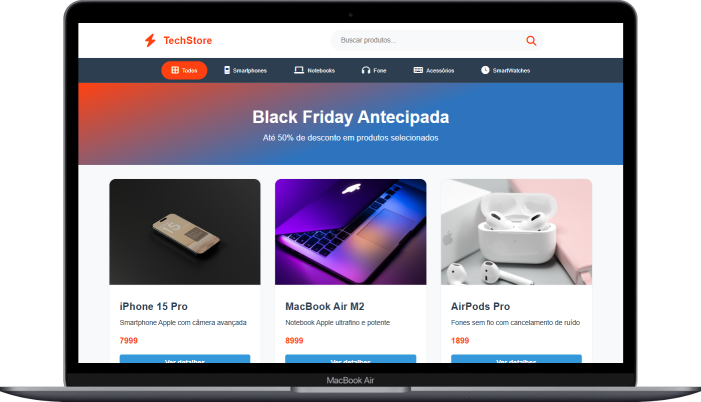

# TechStore 🛍️

Bem-vindo ao repositório do **TechStore**, uma aplicação de e-commerce moderna e responsiva, desenvolvida para proporcionar a melhor experiência de compra de produtos de tecnologia.




## 📜 Sobre o Projeto

O TechStore é uma loja online fictícia, criada como um projeto para demonstrar habilidades em desenvolvimento web. A plataforma apresenta uma interface limpa e intuitiva, com foco em usabilidade e design responsivo, garantindo uma experiência consistente em desktops e dispositivos móveis. O projeto inclui funcionalidades como listagem de produtos, categorias e uma seção de promoções em destaque, como a "Black Friday Antecipada".

## ✨ Funcionalidades Principais

- **Design Responsivo:** Interface totalmente adaptável para diferentes tamanhos de tela, de smartphones a desktops.
- **Listagem de Produtos:** Visualização clara dos produtos com imagem, nome, descrição e preço.
- **Filtragem por Categoria:** Navegação intuitiva através de categorias de produtos como Smartphones, Notebooks, Fones, etc.
- **Barra de Busca:** Ferramenta de busca para encontrar produtos rapidamente.
- **Banner Promocional:** Seção de destaque para promoções e ofertas especiais, como a campanha de Black Friday.

## 🛠️ Tecnologias Utilizadas

O projeto foi construído utilizando tecnologias web modernas, com base no código-fonte apresentado:

- **HTML5:** Para a estruturação semântica do conteúdo.
- **CSS3:** Para a estilização, layout e responsividade, utilizando conceitos como Flexbox.
- **JavaScript:** Para a interatividade e manipulação dinâmica do conteúdo da página.

## 🚀 Como Executar o Projeto

Para visualizar este projeto em sua máquina local, siga os passos abaixo:

1. **Clone o repositório:**

   ```bash
   git clone [https://github.com/seu-usuario/seu-repositorio.git](https://github.com/seu-usuario/seu-repositorio.git)
   ```

2. **Navegue até o diretório do projeto:**

   ```bash
   cd seu-repositorio
   ```

3. **Abra o arquivo `index.html` no seu navegador:**
   - Você pode simplesmente arrastar o arquivo para a janela do seu navegador ou usar uma extensão como o "Live Server" no VS Code para uma melhor experiência de desenvolvimento.

## 🤝 Contribuições

Contribuições são sempre bem-vindas! Se você tiver alguma ideia para melhorar este projeto, sinta-se à vontade para criar um "fork" do repositório e abrir um "pull request".

1.  Faça um Fork do projeto
2.  Crie uma Branch para sua feature (`git checkout -b feature/AmazingFeature`)
3.  Faça o Commit de suas mudanças (`git commit -m 'Add some AmazingFeature'`)
4.  Faça o Push para a Branch (`git push origin feature/AmazingFeature`)
5.  Abra um Pull Request

---
